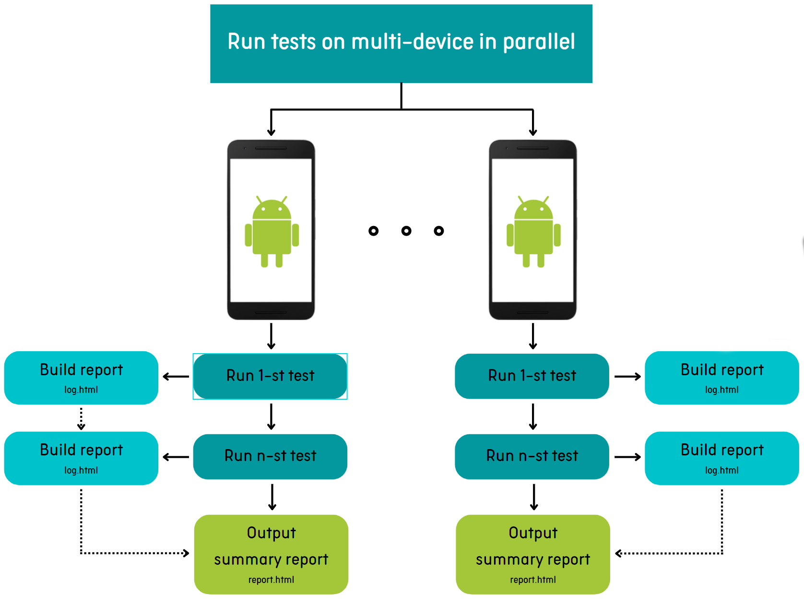

# Introduction
Run tests of Airtest in parallel on multi-device

# How to run
1. Install python and airtest
2. Clone or download this sample
4. Connect multi-device with adb
3. Run 'python run.py' on the project's folder

# Diagram

